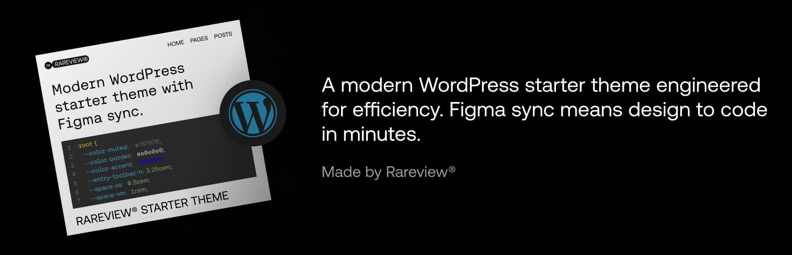

# Rareview Starter Theme



Modern WordPress starter theme for fast, scalable builds.
- Based on the 10up Scaffold
- Follows WP VIP coding standards and best practices
- Supports WP VIP and WPE platforms
- Supports fast global styles setup
	- 130+ variables covering global styles
	- One-command Figma global styles sync (beta)
	- Gutenberg compatibility out of the box
	- Fluid responsiveness out of the box
	- Consistent appearance between frontend and block editor
- Uses the latest PHP without fancy templating languages
- Built with SEO and accessibility in mind
- Translation-ready
- And much more!

## Requirements

- PHP >= 8.2
- Node >= 20
- NPM >= 10
- [Lando](https://lando.dev) v3.25.6+ (recommended)
- [Docker Desktop](https://www.docker.com/products/docker-desktop/) (Mac/Windows)

## Clone a Repo

- Create a new repository by using this repo as a template
- Clone a newly created repo to your local machine
  <br><br>

<hr>

## Initial Setup
After cloning your new repo locally, run the interactive setup script:

```bash
npm run setup
```

This handles all renaming, rebranding, and configuration automatically:
- Renames the theme directory, translation files, and all references
- Performs case-sensitive find-and-replace across all project files
- Updates Lando config, deploy scripts, and CI workflows
- Generates a project-specific `AGENTS.md` for AI-assisted development
- Optionally runs `npm install` and `lando start`

For CI or non-interactive use: `npm run setup -- --yes`
To preview changes: `npm run setup -- --dry-run`

<hr>

## Global Styles Setup

This starter theme relies on theme.json variables and SCSS variables and mixins to set up global styles.
Run the design-system CLI command to choose how you want to configure them:

```bash
npm run design-system
```

You will see three options:

1. **Set variables in the terminal**: Interactive prompts walk through variables setup.
2. **Set variables manually**: Opens the variable mapping guide at `docs/variable-mapping.md`.
3. **Figma auto sync (beta)**: Simply paste a Figma design URL and hit Enter. Extraction quality depends on the Figma design's consistency and structure.

Setting up these variables will make most of the global elements such as headings, buttons, color palette etc. work out of the box, fluid responsive, Gutenberg compatible, looking same in frontend and editor, and easy to maintain and scale because everything comes from a single source of truth - variables and mixins.

___________________________________________________________

## Local Environment Setup

See [Local Development Setup](.local/docs/local-development-setup.md) for details.

## Theme Development

See [Theme Development](.local/docs/theme-development.md) for details.

## License

This repository includes mixed-licensed components:

- WordPress core/upstream components: GPL (see `license.txt`)
- Custom RV project code (scripts, tooling, and theme code): MIT (see `LICENSE.md` and `wp-content/themes/rv-starter/LICENSE.md`)
